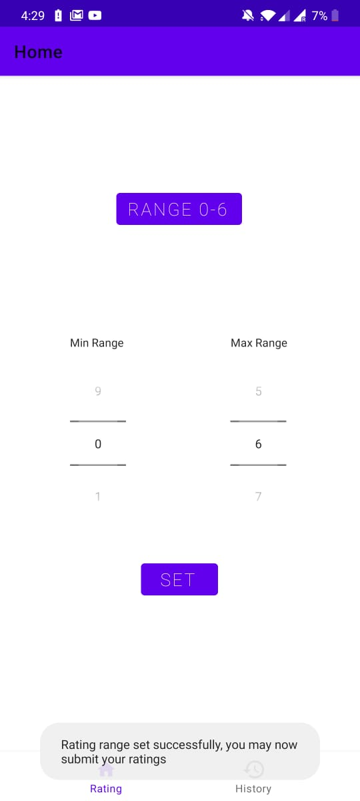
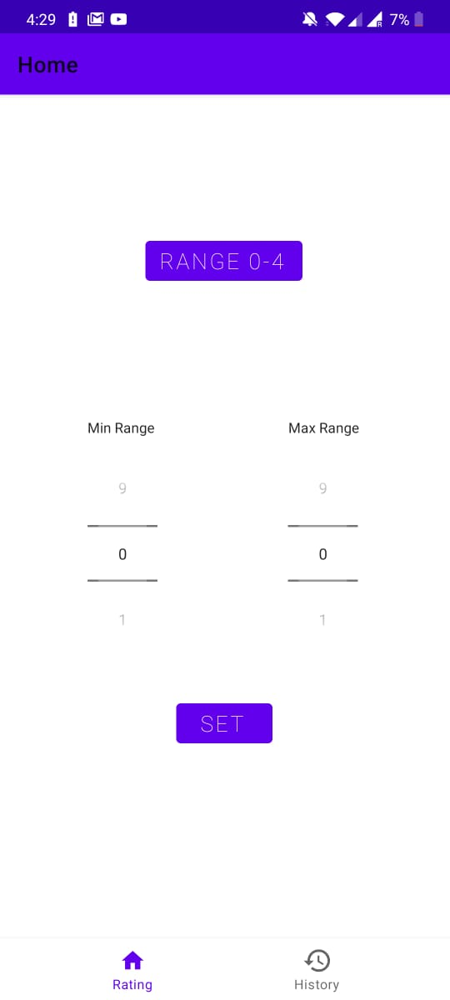
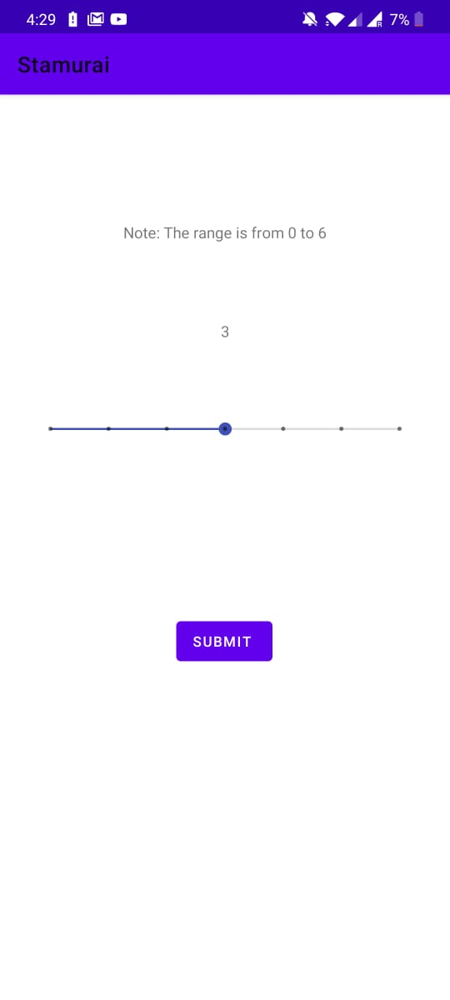
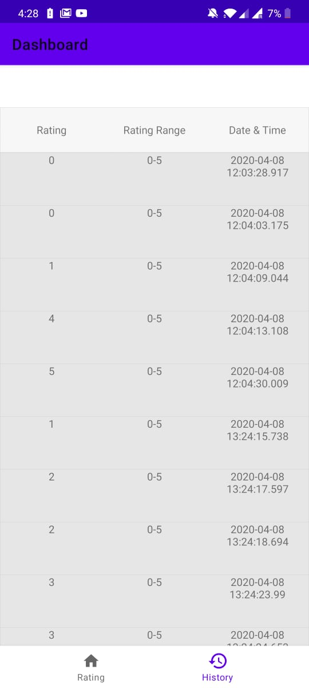

# Stamurai

An android app which allows you to set a rating range and then also submit ratings in those range.
The submitted ratings appear in the history section of the app.

# Technologies used

The app is written in Kotlin, and I have also used SQLite to maintain the history section of the app.

On opening the app, the user would be presented with a screen with options to set the rating range

Once valid range is set, the user may submit ratings.

The previous ratings are then made visible in the history fragment.

